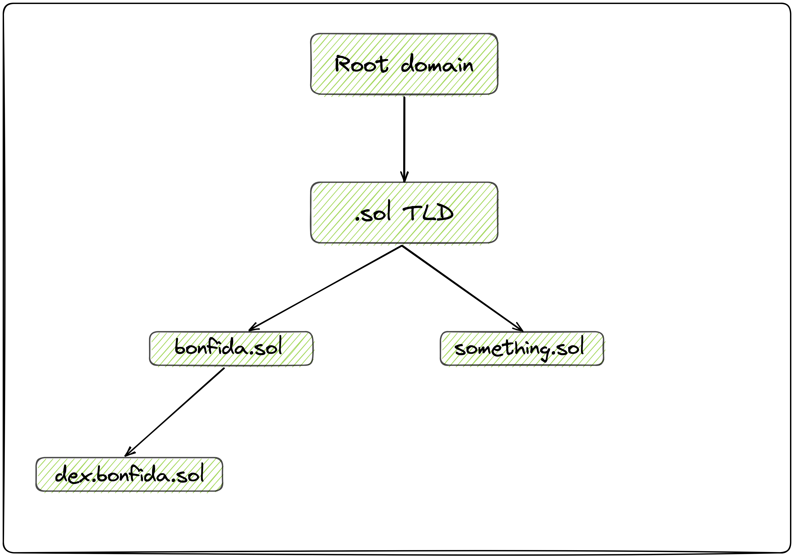

# TLD

In Solana, the hierarchy of domain names and the TLD system is organized similarly to the traditional internet domain structure. The top of the hierarchy is the Root domain, which holds the Top Level Domains (TLDs) like `.sol`.

Under the Root domain, you have the TLDs, such as `.sol`. All the domain names registered with the .sol extension are considered children (or subdomains) of the `.sol` TLD. For example, bonfida.sol is a child of the `.sol` TLD.

Further down the hierarchy, you can have subdomains of the registered domain names. For instance, `dex.bonfida.sol` is a child of `bonfida.sol`.

In simple terms, the hierarchy of Solana domain names starts with the Root domain, followed by TLDs (e.g., `.sol`), then the registered domain names (e.g., `bonfida.sol`), and finally any subdomains (e.g., `dex.bonfida.sol`). This hierarchical structure allows for an organized way to manage and identify domain names on the Solana network.

## TLD list

- Root TLD: `ZoAhWEqTVqHVqupYmEanDobY7dee5YKbQox9BNASZzU`
- .sol TLD: `58PwtjSDuFHuUkYjH9BYnnQKHfwo9reZhC2zMJv9JPkx`
