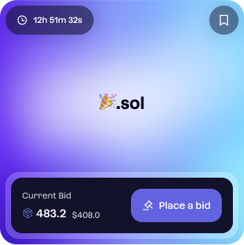

# Media kit

> **Follow these guidelines when representing domain names on your website.**

Domains names can be represented in two ways: inline and card.

Below are two examples of the inline and card representations.

1. **Inline**

2. **Card**

## Rare domains

Rare domains are domains with 4 or less characters. These domains must be represented with the following gradient.

### Gradient:

### Card representation

### Inline representation

## Emoji domains

Emoji domains are domains that contain an emoji. These domains must be represented with the following gradient.

### Card representation

### Inline representation

## Regular domains

Regular domains are domains that have 5 or more characters and do not contain an emoji. These domains must be represented with the following gradient.

### Card representation

### Inline representation

