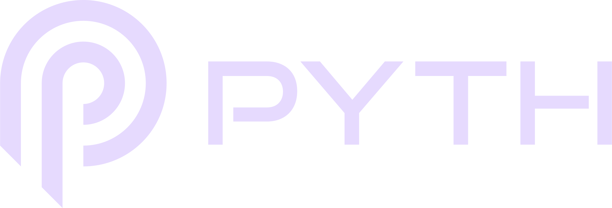

# Registration

> **Deprecated:** The `registerDomainName` function is being deprecated as it relies on the older Pyth smart contract on Solana, which is scheduled to be sunsetted at the end of May 2024. Please transition to using `registerDomainNameV2` for future domain registrations.

Easily integrate SNS domain registrations into your applications using our SNS Widget React Component. See a default usage example below. You can also customize the widget to fit your unique needs. More information is available here: https://github.com/Bonfida/sns-widget/blob/main/README.md

```js
import Widget from "@bonfida/sns-widget";
// Apart from the component itself, you also need to import styles separately
import "@bonfida/sns-widget/style.css";

// Link to public RPC for Solana connection. Solana provides free public RPCs
// with rate limiters, so you might want to use your own RPC Node provider
const PUBLIC_RPC = "https://api.mainnet-beta.solana.com";

export const Component = () => {
  return <Widget endpoint={PUBLIC_RPC} />;
};
```

You can also opt to create registration instructions via our SDK or API, both methods are equivalent. To register a domain you will have to specify the following:

- Domain names
- Space (between 1kb and 10kb)
- The public key of the buyer

Domain names can be registered with the following tokens: USDC, USDT, wSOL, FIDA, mSOL, BONK and BAT.

> **Note:** The registration instruction does not support native SOL but wrapped SOL

## Asset pricing

<p align="center">
<a href="https://pyth.network/" target="_blank">

</a>
</p>

Token pricing data during domain registration is provided to us by our friends at Pyth Network. Learn more about their Blockchain Oracle at [Pyth Network](https://pyth.network/).

## SDK

Unregistered domains can be registered using the SDK `@bonfida/spl-name-service` with the following instructions:

```js
import { registerDomainNameV2 } from "@bonfida/spl-name-service";

const name = "bonfida"; // We want to register bonfida.sol
const space = 1 * 1_000; // We want a 1kB sized domain (max 10kB)

const buyer = new PublicKey("..."); // Publickey of the buyer
const buyerTokenAccount = new PublicKey("..."); // Publickey of the token account of the buyer (USDC)

const ix = await registerDomainNameV2(name, space, buyer, buyerTokenAccount);

// sign and send the instruction
```

## API

Registration instructions can also be created via API (equivalent to using the SDK):

```
GET https://sns-sdk-proxy.bonfida.workers.dev/register?buyer={buyer}&domain={domain}&space={space}&serialize={serialize}
```

This endpoint can be used to register domain for buyer. Additionaly, the buyer dans specify the space it wants to allocate for the domain account. In the case where serialize is true the endpoint will return the transaction serialized in the wire format base64 encoded. Otherwise it will return the instruction in the following format: `{ programId: string, keys: {isWritable: boolean, isSigner: boolean, pubkey: string}[], data: string }` where `data` is base64 encoded.

This endpoint also supports the optional mint parameter to change the mint of the token used for registration (currently supports USDC, USDT, FIDA and wSOL), if mint is omitted it defaults to USDC.
