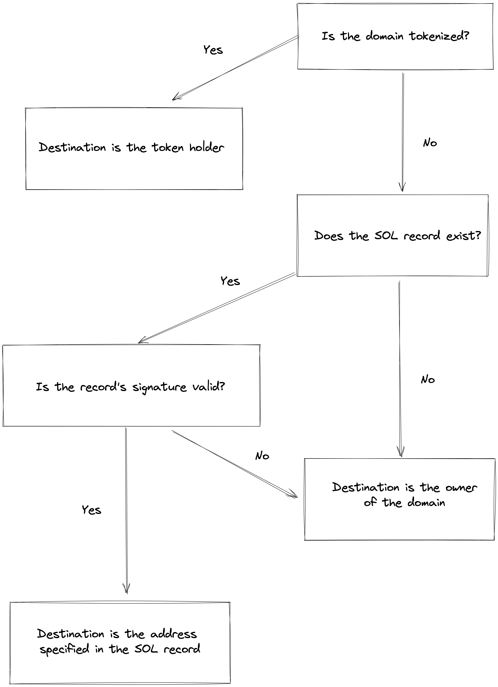

# Resolving domains

Below is the correct methodology to resolve `.sol` domain names. If you are a wallet or a service provider using SNS to send funds please make sure to follow these guidelines to avoid loss of funds.



1. Check if the domain name is tokenized

   - **Yes:** The correct destination of funds is the token holder
   - **No:** Go to step 2

2. Check the SOL record

   - **If** the SOL record is set and the signature is valid, the public key specified in the record is the correct destination. If the signature is invalid go to step 3
   - **Else** go to step 3

3. The correct destination of funds is the domain owner

A JS implementation would be as follow:

```js
import { Connection, PublicKey } from "@solana/web3.js";
import { getSolRecord } from "./record";
import { getDomainKey } from "./utils";
import { NameRegistryState } from "./state";
import { sign } from "tweetnacl";
import { Record } from "./types/record";

/**
 * This function can be used to verify the validity of a SOL record
 * @param record The record data to verify
 * @param signedRecord The signed data
 * @param pubkey The public key of the signer
 * @returns
 */
export const checkSolRecord = (
  record: Uint8Array,
  signedRecord: Uint8Array,
  pubkey: PublicKey
) => {
  return sign.detached.verify(record, signedRecord, pubkey.toBytes());
};

/**
 * This function can be used to resolve a domain name to transfer funds
 * @param connection The Solana RPC connection object
 * @param domain The domain to resolve
 * @returns
 */
export const resolve = async (connection: Connection, domain: string) => {
  const { pubkey } = await getDomainKey(domain);

  const { registry, nftOwner } = await NameRegistryState.retrieve(
    connection,
    pubkey
  );

  if (nftOwner) {
    return nftOwner;
  }

  try {
    const recordKey = await getDomainKey(Record.SOL + "." + domain, true);
    const solRecord = await getSolRecord(connection, domain);

    if (solRecord.data?.length !== 96) {
      throw new Error("Invalid SOL record data");
    }

    const encoder = new TextEncoder();
    const expectedBuffer = Buffer.concat([
      solRecord.data.slice(0, 32),
      recordKey.pubkey.toBuffer(),
    ]);
    const expected = encoder.encode(expectedBuffer.toString("hex"));

    const valid = checkSolRecord(
      expected,
      solRecord.data.slice(32),
      registry.owner
    );

    if (!valid) {
      throw new Error("Signature invalid");
    }

    return new PublicKey(solRecord.data.slice(0, 32));
  } catch (err) {
    console.log(err);
  }

  return registry.owner;
};
```

> Not resolving domains properly might lead to loss of funds ⚠️

## FAQ

1. What happens if funds are sent to the `NameRegistry` owner when the domain is tokenized?

As long as the user owns the tokenized domains (i.e the NFT) they will be able to withdraw from the PDA escrow that received the funds. However, if for some reason the user does not own the NFT they won't be able to withdraw the funds.

2. Why is there a signature in the SOL record?

The SOL record data contains a 96-byte array that is the concatenation of a public key (32 bytes) and signature (64 bytes). The first 32 bytes represent the public key (`pubkey`) to which funds should be sent and the next 64 bytes are the signature of `pubkey_as_bytes + record_key_as_bytes` signed by the owner of the domain. If the signature is invalid funds **must not** be transferred to the SOL record address.

The signature is required to prevent funds being sent to a stale SOL record after a domain has been transferred or sold to a new owner.
