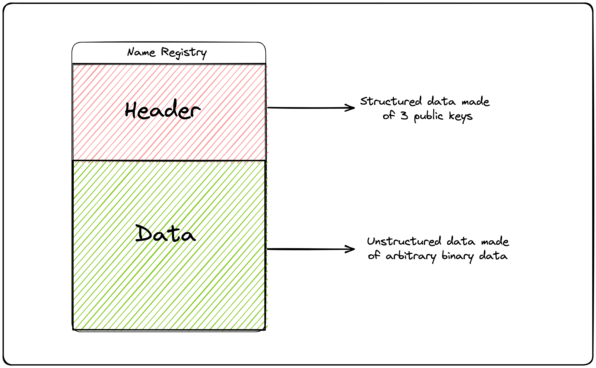

# Name Registry: Understanding Domains on Solana

Solana can be viewed as a key-value database, where everything, including domains, is uniquely identifiable by a public key. The data inside a domain account contains an object called the Name Registry. The Name Registry is made of a header and payload.

## Name Registry Explained

<center>

</center>

### Name Registry Header

he header contains three public keys that define the domain's properties:

- Parent: Represents the parent domain in the hierarchy.
- Owner: Indicates the entity that has control over the domain.
- Class: A special key that enables advanced use-cases, such as third-party verification in a badge system.

Below is the structure of the header in Rust:

```rust
/// The layout of the remaining bytes in the account data are determined by the record `class`
#[derive(Clone, Debug, BorshSerialize, BorshDeserialize, PartialEq)]
pub struct NameRecordHeader {
    // Names are hierarchical.  `parent_name` contains the account address of the parent
    // name, or `Pubkey::default()` if no parent exists.
    pub parent_name: Pubkey,

    // The owner of this name
    pub owner: Pubkey,

    // The class of data this account represents (DNS record, twitter handle, SPL Token name/symbol, etc)
    //
    // If `Pubkey::default()` the data is unspecified.
    pub class: Pubkey,
}
```

### Data: Flexible Data Storage

he data section can hold arbitrary binary data. Its length is set during domain registration, and the domain owner can decide what to store in this part of the Name Registry.

In simple terms, the Name Registry data structure provides a way to organize and store information about a domain on Solana, including its relationships, ownership, and any additional data the owner wishes to include.
